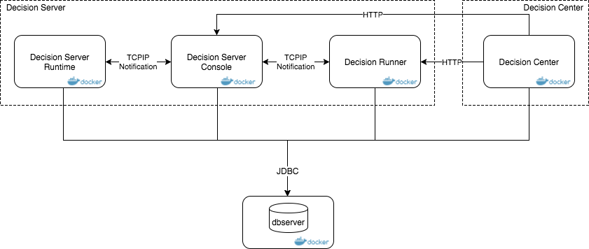

# IBM-ODM-Docker
IBM Operational Decision Manager on Docker.

  <a href="https://join.slack.com/t/odmdev/shared_invite/enQtMjU0NzIwMjM1MTg0LTQyYTMzNGQ4NzJkMDYxMDU5MDRmYTM4MjcxN2RiMzNmZWZmY2UzYzRhMjk0N2FmZjU2YzJlMTRmN2FhZDY4NmQ">
        Follow us on slack
         
        
  </a>

## Deploy IBM Operational Decision Manager  on Docker from Dev to Production

This repository centralizes the material to deploy IBM Operational Decision Manager in Docker.
It includes Docker files and Docker compose descriptors. Docker files are used to build images of ODM runtimes. And docker-compose descriptor can be used to group this build, push to your repository and run your topology from Development to production.

[IBM ODM](https://www.ibm.com/support/knowledgecenter/SSQP76_8.10.x/welcome/kc_welcome_odmV.html) is a decisioning platform to automate your business policies. Business rules are used at the heart of the platform to implement decision logic on a business vocabulary and run it as web decision services.

In addition to this repository about ODM on Docker, there is a dedicated repository to deploy [ODM on Kubernetes](https://github.com/PierreFeillet/IBM-ODM-Kubernetes/?cm_mc_uid=48109996374214948388780&cm_mc_sid_50200000=1497520790) and the [IBM Operational Decision Manager for Developers docker image](https://hub.docker.com/r/ibmcom/odm/) in dockerhub.

### Deploying ODM Rules in the following environments
This documentations applies to Operational Decision Management Standard V8.10.x and to earlier versions up to v8.8.x.
- [ODM Standalone Docker image](docs/README_standalone.md): Explain how to build one docker image that contain all the ODM Components. (For Development purpose)
- [ODM Standard Docker topology](docs/README_standard.md): Explain how to build and instanciate one docker image per ODM Components. (For Pre-Production purpose)
- [ODM Clustered Docker topology](docs/README_cluster.md): Explain how to build and instanciate one docker image per ODM Components with possibility to scale the number of container. (For Production purpose)
- [ODM integration with Business Automation Intelligence](contrib/bai-singlenode/README.md): Explain how to demonstrate ODM with BAI for Server with minimal effort.

## References
- [DevWorks article : Deploy an IBM Operational Decision Manager topology with Docker Compose](https://www.ibm.com/developerworks/library/mw-1612-grateau-trs/1612-grateau.html)
- [IBM Operational Decision Manager Developer Center](https://developer.ibm.com/odm/)

## Issues and contributions

For issues relating specifically to the Dockerfiles and scripts, please use the [GitHub issue tracker](https://github.com/lgrateau/odm-ondocker/issues). For more general issue relating to IBM Operational Decision Manager you can [get help](https://developer.ibm.com/odm/home/connect/) through the ODMDev community or, if you have production licenses for Operational Decision Manager, via the usual support channels. We welcome contributions following [our guidelines](https://github.com/lgrateau/odm-ondocker/blob/master/CONTRIBUTING.md).

## License
[Apache 2.0](LICENSE)

## Notice
© Copyright IBM Corporation 2018.
