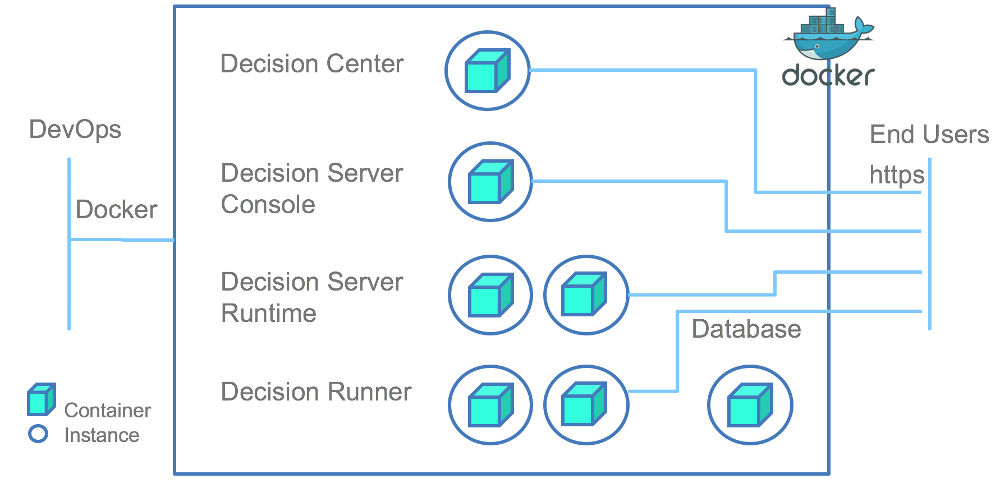

# IBM-ODM-Docker
IBM Operational Decision Manager on Docker

#  Deploy IBM Operational Decision Manager Standard on Docker from Dev to Production 

This repository centralizes the material to deploy IBM Operational Decision Manager Standard in Docker. 
It includes Docker files and Docker compose descriptors. Docker files are used to build images of ODM runtimes. And Docker compose desctiptor can be used to group this build, push to your repository and run your topology from Development to production.

[IBM ODM](https://www.ibm.com/support/knowledgecenter/SSQP76_8.9.0/welcome/kc_welcome_odmV.html) is a decisioning platform to automate your business policies. Business rules are used at the heart of the platform to implement decision logic on a business vocabulary and run it as web decision services.

In addition to this repository about ODM on Docker, there is a dedicated repository to deploy [ODM on Kubernetes]().
## Deploying ODM Rules in the following environments
- [ODM Standalone Docker image](README_standalone.md): Explain how to build one docker image that contain all the ODM Components. (For Development purpose)
- [ODM Standard Docker topology](README_standard.md): Explain how to build and instanciate one docker image per ODM Components. (For Pre-Production purpose) 
- [ODM Clustered Docker topology](README_cluster.md): Explain how to build and instanciate one docker image per ODM Components with possibility to scale the number of container. (For Production purpose) 
 
## References

# License
[MIT](License.txt)

