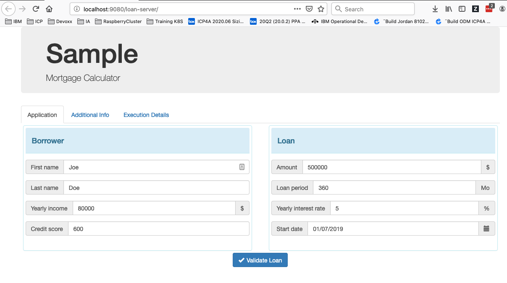
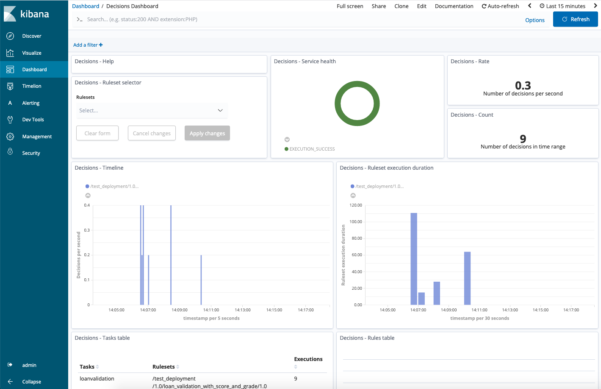

# Integration of BAI single node deployment with ODM Evaluation

The goal of this integration is to easily run ODM and emit events to BAI for server (formerly known as BAI single node) deployment with a minimum effort.

# Pre-Prerequisites
  * Docker
  * Docker-compose
  * Machine configuration :
    * 6 CPU
    * 11 Gb

# Preparing the installation
  * Install and deploy BAI for server (formerly known as BAI single node). To do this you need to download the .tgz archive from PPA.
     * Download the archive from Passport Advantage (PPA).
     * Extract the files.
```Shell
$ tar -xzvf <bai_sn_install_dir>/bai-single-node-$VERSION.tgz
``` 
>  For full details of installation process see https://www.ibm.com/support/knowledgecenter/en/SSYHZ8_19.0.x/com.ibm.dba.install/bai_sn_topics/tsk_bai_single_node_deploy.html.
  >The BAI installation directory is referred to as BAI_DIR.
  
  
  
  * Git clone this repository, or download an odm-ondocker release. The git clone directory is referred to as ODM_DIR.

```Shell
$ git clone https://github.com/ODMDev/odm-ondocker
```

# Installing
  * Create a directory <BAI_DIR>/odm

  ```Shell
  Ex:
  $ cd bai-for-server-20.0.1
  $ mkdir odm
  ```
  * Copy the directory <ODM_DIR>/contrib/bai-singlenode/* to <BAI_DIR>/odm
  ```Shell
  Ex:
  $ cp ~/odm-ondocker/contrib/bai-singlenode/*  bai-for-server-20.0.1/odm
  ```

 You should see this layout
    [TODO] create images directory and put a screenshot of the finder of BAI_DIR
    


# Start the ODM with BAI Integration
## Start BAI
```Shell
$ cd <BAI_DIR>/bin
$ ./bai-start --acceptLicense --init
```

> Note: The first time you run BAI for server (formerly known as BAI single node) deployment you need to provide the hostname of your machine. This hostname is used for certificate generation. The hostname can change depending on your network. A good workaround is to add an entry in the /etc/hosts file of your machine to map a symbolic hostname, eg MyMachine, to the IP address; you then simply update the IP address in the file when you move networks.

## Start ODM
```Shell
$ cd <BAI_DIR>/odm && ./odm-bai-start.sh
-> Wait a couple of minutes .....
```

Configure the ruleset property of the sample to emit events:
```Shell
$ cd <BAI_DIR>/odm
$ ./set-loan-server-props
```

If the script fails you can set the properties manually in the RES console, see https://www.ibm.com/support/knowledgecenter/en/SSQP76_8.10.x/com.ibm.odm.dserver.rules.res.console/topics/con_rescons_rs_prop_bai.html.

# Play with the integration
## Scenario
  - Open a web browser
  - Open the BAI kibana dashboard. http://localhost:5601/
    - Login with your credential
    - Go to Dashboards and select the Decision Dashboard
    - The dashboard should be empty
  - Open http://localhost:9080/loan-server/
    - Click "Validate Loan" button multiple times
    - Go back to the dashboard. The loan events should be displayed in the dashboard







## Known limitations
 * In the loan server sample, the Trace output option on the Execution Details tab is not compatible with BAI event emission. Do not use this option with rulesets for which you have enabled emission.

## TODO

| Description | Comments |
--- | ---
| Loop until ODM is ready | |
| Once loop is done set properties if needed | |
