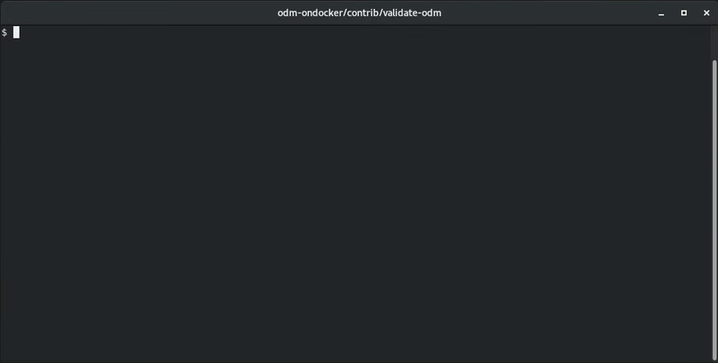

# validate-odm.sh

[](https://github.com/DecisionsDev/odm-ondocker/releases/download/v9.0.0.1/validate-odm-script.zip)
<!-- WARNING: Do not modify the link -->
<!-- The url is automatically updated by the publish.yml workflow -->

The script [validate-odm.sh](./validate-odm.sh) can be used to validate the installation of ODM.



The script performs the following scenario:
1. Import a decision service
2. Run a test suite
3. Deploy the RuleApps
4. Verify the RuleApps in RES
5. Execute a RuleApp in DSR
6. [Optional] Delete the RuleApps in RES

## Prerequisites

- Start ODM components.
  You can use ODM docker images or ODM instance deployed using the ODM on K8S chart.
  > **Warning**  
  > ODM instance installed using CP4BA operator are not supported.

- Take a note of the endpoints of your components:
  - Decision Center (DC)
  - Decision Server Console (RES)
  - Decision Server Runtime (DSR) components
- Download and extract the zip file containing the script and resources.
- Set the required environment variables manually or use a `.env` file.
  Refer to [Environment Variables](#Environment-Variables) for more information.

## Usage

```
./validate-odm.sh [-c] [-h]
```

Optional script parameters:
- `-c` :  Cleans the created ruleApps at the end of the test.
- `-h` :  Displays the help page.

### Environment Variables

The script configuration file requires the following environment variables to be defined manually or in a `.env` file:

* **ODM endpoints configuration**
  - `DC_URL`  : Endpoint of the Decision Center instance to test.
  - `RES_URL` : Endpoint of the Decision Server Console (RES) instance to test.
  - `DSR_URL` : Endpoint of the Decision Server Runtime instance to test.

  > **Note**  
  > Endpoint corresponds to the service URL or the route URL without the context route of the application.

* **Authentication configuration**
  - To use *basic* authentication mode, define:
    - `ODM_CREDS` : Credentials to connect to ODM using the format `<user>:<password>`
  - To use *openID* authentication mode, define:
    - `ODM_CREDS` : Credentials to get the token using the format `<clientId>:<clientSecret>`
    - `OPENID_URL` : URL of the OpenId Server

> **Note**  
> You can fill the provided [.env.template](./.env.template) file with your configuration:
> ```
> $ mv .env.template .env
> $ vi .env
> ```

## Examples

* To validate an ODM instance described in the `.env` file and clean at the end of the test:
  ```
  $ ./validate-odm.sh -c
  📥  Upload Decision Service to DC:  COMPLETED
  🧪  Running Main Scoring test suite in DC ...  
      ▪ Wait for Main Scoring test suite to be completed in DC:  DONE
      ▪ Test report status in DC:  SUCCEEDED
  🚀  Deploy RuleApp test_deployment/1.0 to DC:  COMPLETED
  🔎  Verifying test_deployment RuleApp deployment ...
      ▪ Get RuleApp test_deployment/1.0 in RES:  DONE
      ▪ Verify last RuleSet deployed test_deployment/1.0/loan_validation_production/1.0 in RES:  SUCCEEDED
      ▪ Verify last RuleSet deployed test_deployment/1.0/loan_validation_with_score_and_grade/1.0 in RES:  SUCCEEDED
  🚀  Deploy RuleApp production_deployment/1.0 to DC:  COMPLETED
  🔎  Verifying test_deployment RuleApp deployment ...
      ▪ Get RuleApp production_deployment/1.0 in RES:  DONE
      ▪ Verify last RuleSet deployed production_deployment/1.0/loan_validation_production/1.0 in RES:  SUCCEEDED
  🧪  Running RuleSet test ...
      ▪ Test RuleSet production_deployment/1.0/loan_validation_production/1.0 in DSR:  COMPLETED
      ▪ Check RuleSet test result in DSR:  SUCCEEDED
  🗑️  Cleaning ...
      ▪ Delete RuleApp test_deployment/1.0 in RES:  DONE
      ▪ Delete RuleApp production_deployment/1.0 in RES:  DONE
  🎉  ODM has been successfully validated!
  ```

  > **Note**  
  > To be able to see the emojis, a font like `fonts-noto-color-emoji` should be installed in your terminal.

* To validate an ODM instance using basic authentication and setting environment variables manually:
  ```
  $ export DC_URL=https://<clusterip>:<dc-port>
  $ export RES_URL=https://<clusterip>:<res-port>
  $ export DSR_URL=https://<clusterip>:<dsr-port>
  $ export ODM_CREDS=<user>:<password>

  $ ./validate-odm.sh
  ```
