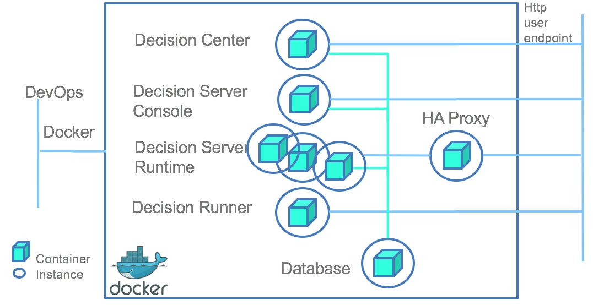
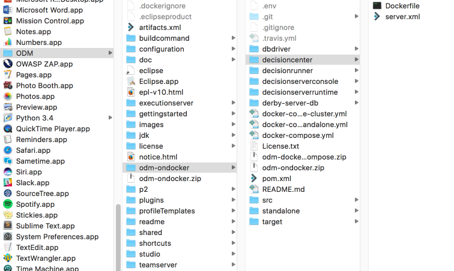
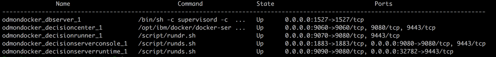

This tutorial explains how to start an Operational Decision Manager docker cluster topology for development, using Docker Compose. It applies to Operational Decision Management Standard V8.9.0.1 and to earlier versions up to v8.8.x.





## Setting up your environment

Before you proceed, install [Docker and Docker Compose](https://docs.docker.com/compose/#installation-and-set-up).

### Install Operational Decision Manager
To create Operational Decision Manager docker images, install one of the following components:         
* Decision Center, with the WebSphere Liberty Profile option,
* Decision Server Rules, with the WebSphere Liberty Profile option.

Go to the Operational Decision Manager installation directory and locate the required WAR files in the directories listed below:

*installation_directory/executionserver/applicationservers/WLP855/res.war*

*installation_directory/executionserver/applicationservers/WLP855/DecisionService.war*

*installation_directory/teamserver/applicationservers/WLP855/teamserver.war*

*installation_directory/teamserver/applicationservers/WLP855/decisioncenter.war*

*installation_directory/executionserver/applicationservers/WLP855/DecisionRunner.war*

### Clone the odm-ondocker code

In the installation directory, enter ```git clone https://github.com/ODMDev/odm-ondocker.git```.

### Copy the .dockerignore file

Copy the odm-ondocker/resources/.dockerignore file into the ODM installation directory.

```cp odm-ondocker/resources/.dockerignore ./```

When the copy is complete, the content of your repository should be similar to this:


### Verify that Docker Engine and Docker Compose are running

Open a command prompt and run the following two commands:    	

  ```
    > docker -–version
    Docker version 1.12.3
    > docker-compose version
    docker-compose version 1.8.1
  ```

Now you are ready to build and run the docker images.

## Building and running the docker image
Open a command prompt in the directory **installation_directory/odm-ondocker** and run the following command:    	

```
docker-compose -f odm-cluster.yml up
```

This command builds, creates, and runs these six docker containers:

* Embedded Derby database
* Load balancer high availability proxy server
* ODM Decision Server runtime
* ODM Decision Server console
* ODM Decision Center
* ODM Decision Runner

Docker Compose builds and runs the containers if they are not already built.

You can also choose to start only one Operational Decision Manager component. For example, this command line starts Decision Center and its dependencies, including the dbserver Derby Network server.

```docker-compose -f odm-cluster.yml up decisioncenter```

You can access the application with these URLs:

|Component|URL|Username|Password|
|:-----:|:-----:|:-----:|:-----:|
| [Decision Server Console](http://localhost:9080/res) | <http://localhost:9080/res> |resAdmin|resAdmin|
| [Decision Server Runtime](http://localhost/DecisionService) |<http://localhost/DecisionService> |N/A|N/A|
| [Decision Center Business Console]( http://localhost:9060/decisioncenter) |  <http://localhost:9060/decisioncenter> |rtsAdmin|rtsAdmin|
| [Decision Center Enterprise Console]( http://localhost:9060/teamserver) |  <http://localhost:9060/teamserver> |rtsAdmin|rtsAdmin|
| [Decision Runner]( http://localhost:9070/DecisionRunner) |  <http://localhost:9070/DecisionRunner> |resDeployer|resDeployer|
| [Load balancer stats](http://localhost:1936/) | <http://localhost:1936/> | stats | stats |


To add a Decision Server runtime member to the cluster, run the following command:
```
docker-compose -f odm-cluster.yml scale decisionserverruntime=2
```

You should see two runtime environments attached to the Rule Execution Server console. The load balancer is configured with a round robin algorithm, the default load-balancing logic that dispatches a new request to the next cluster member in a circular list.

## Verifying the docker images

You can check the container status with the following command:
```
 docker-compose ps
```
 This screen capture displays the list of running containers.



To check the clustered Decision Server topology, complete the following steps:

* Open the Rule Execution Server console at http://localhost:9080/res with these username and password: resAdmin / resAdmin.
* Open the REST Test form at http://localhost/DecisionService/run.jsp?path=/miniloan/1.0/miniloan/1.0&trace=false&type=WADL&kind=native.
* Click the Execute Request button twice.
* Click the Server Info tab. 
  You should see  execution units.
