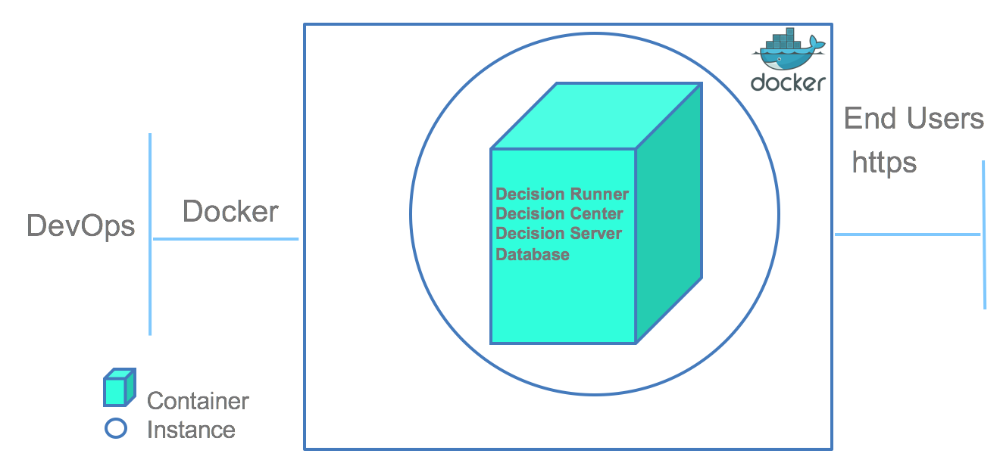

This tutorial explains how to build and start a docker image that includes all the IBM Operational Decision Manager components in one container. It applies to Operational Decision Manager Standard V8.9.0.x and to earlier versions up to V8.8.x.





## Setting up your environment

Before you proceed, install [Docker and Docker Compose](https://docs.docker.com/compose/#installation-and-set-up).

### Install Operational Decision Manager
To create the Operational Decision Manager docker image, install one of the following components:         
* Decision Center, with the WebSphere Liberty Profile option,
* Decision Server Rules, with the WebSphere Liberty Profile option.

Go to the Operational Decision Manager installation directory and locate the required WAR files in the directories listed below:

*installation_directory/executionserver/applicationservers/WLP855/res.war*

*installation_directory/executionserver/applicationservers/WLP855/DecisionService.war*

*installation_directory/teamserver/applicationservers/WLP855/teamserver.war*

*installation_directory/teamserver/applicationservers/WLP855/decisioncenter.war*

*installation_directory/executionserver/applicationservers/WLP855/DecisionRunner.war*

### Clone the odm-ondocker code

From the ODM installation directory, enter ```git clone https://github.com/ODMDev/odm-ondocker.git```. 

### Copy .dockerignore file

Copy the odm-ondocker/resources/.dockerignore file into the ODM installation directory.

```cp odm-ondocker/resources/.dockerignore ./```

When the copy is complete, the content of your repository should be similar to this:


### Verify that Docker Engine and Docker Compose are running

Open a command prompt and run the following two commands:    	

  ```
    > docker -–version
    Docker version 1.12.3
    > docker-compose version
    docker-compose version 1.8.1
  ```

Now you are ready to build and run the docker images.

## Building and running the docker image
Open a command prompt in the directory **installation_directory/odm-ondocker** and run the following command:    	

```
docker-compose -f odm-standalone.yml up
```

This command creates one docker container with the following components:

* Embedded Derby database
* HA Proxy load balancer
* ODM Decision Server runtime
* ODM Decision Server console
* ODM Decision Center
* ODM Decision Runner

You can access the application with these URLs:

|Component|URL|Username|Password|
|:-----:|:-----:|:-----:|:-----:|
| [Decision Server Console](http://localhost:9080/res) | <http://localhost:9080/res> |resAdmin|resAdmin|
| [Decision Server Runtime](http://localhost:9080/DecisionService) |<http://localhost:9080/DecisionService> |N/A|N/A|
| [Decision Center Business Console]( http://localhost:9080/decisioncenter) |  <http://localhost:9080/decisioncenter> |rtsAdmin|rtsAdmin|
| [Decision Center Enterprise Console]( http://localhost:9080/teamserver) |  <http://localhost:9080/teamserver> |rtsAdmin|rtsAdmin|
| [Decision Runner]( http://localhost:9080/DecisionRunner) |  <http://localhost:9080/DecisionRunner> |resDeployer|resDeployer|

## Verifying the docker images

You can check the container status with the following command:
```
 docker-compose ps
```
