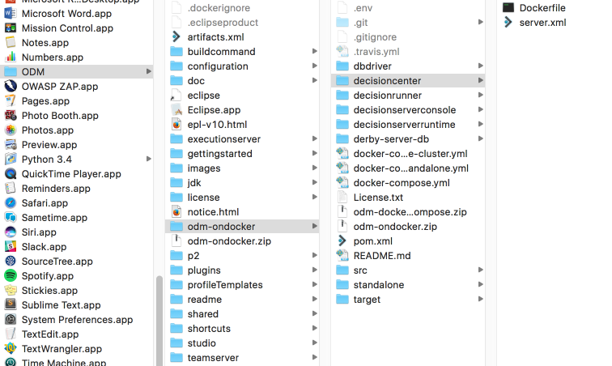

This part will show you how to build and start a Docker image that contains all the ODM components in one container.


This tutorial applies to IBM ODM Standard V8.9.0.x and previous versions back as far as IBM ODM V8.8.x.

First, you need to install [Docker and Docker Compose](https://docs.docker.com/compose/#installation-and-set-up).

## Setup your environment

### ODM Installation.
To create this IBM ODM Docker image, you need to install one of the following parts of IBM ODM:         
* Decision Center (WebSphere Liberty Profile option)
* Decision Server Rules (WebSphere Liberty Profile option)

On the file system where you installed IBM ODM V8.8.x or V8.9.x with WebSphere Liberty Profile option, find the required WAR files in the following locations:

*installation_directory/executionserver/applicationservers/WLP855/res.war*

*installation_directory/executionserver/applicationservers/WLP855/DecisionService.war*

*installation_directory/teamserver/applicationservers/WLP855/teamserver.war*

*installation_directory/teamserver/applicationservers/WLP855/decisioncenter.war*

*installation_directory/executionserver/applicationservers/WLP855/DecisionRunner.war*

### Clone the odm-ondocker code

```git clone https://github.com/ODMDev/odm-ondocker.git``` in the IBM ODM installation directory.

### Copy .dockerignore file

Copy the odm-ondocker/resources/.dockerignore file in your IBM ODM installation directory.

```cp odm-ondocker/resources/.dockerignore ./```

At the end of these steps you should have something like :


### Verify that Docker Engine and Docker Compose are running.

Open a command prompt and run the following two operations:    	

  ```
    > docker -–version
    Docker version 1.12.3
    > docker-compose version
    docker-compose version 1.8.1
  ```

You are now ready to build and run the Docker images.

## Build and run the docker image
Open a command prompt in the directory **installation_directory/odm-ondocker** and run the following command:    	

```
docker-compose -f odm-standalone.yml up
```

This command creates one docker container with the following components:

* Embedded Derby database
* HA Proxy load balancer
* ODM Decision Server runtime
* ODM Decision Server console
* ODM Decision Center
* ODM Decision Runner

You can access the application with this URLs:

|Component|URL|Username|Password|
|:-----:|:-----:|:-----:|:-----:|
| [Decision Server Console](http://localhost:9080/res) | <http://localhost:9080/res> |resAdmin|resAdmin|
| [Decision Server Runtime](http://localhost:9080/DecisionService) |<http://localhost:9080/DecisionService> |N/A|N/A|
| [Decision Center Business Console]( http://localhost:9080/decisioncenter) |  <http://localhost:9080/decisioncenter> |rtsAdmin|rtsAdmin|
| [Decision Center Enterprise Console]( http://localhost:9080/teamserver) |  <http://localhost:9080/teamserver> |rtsAdmin|rtsAdmin|
| [Decision Runner]( http://localhost:9080/DecisionRunner) |  <http://localhost:9080/DecisionRunner> |resDeployer|resDeployer|

## Verify the Docker images

You can check the container status with the following command:
```
 docker-compose ps
```
