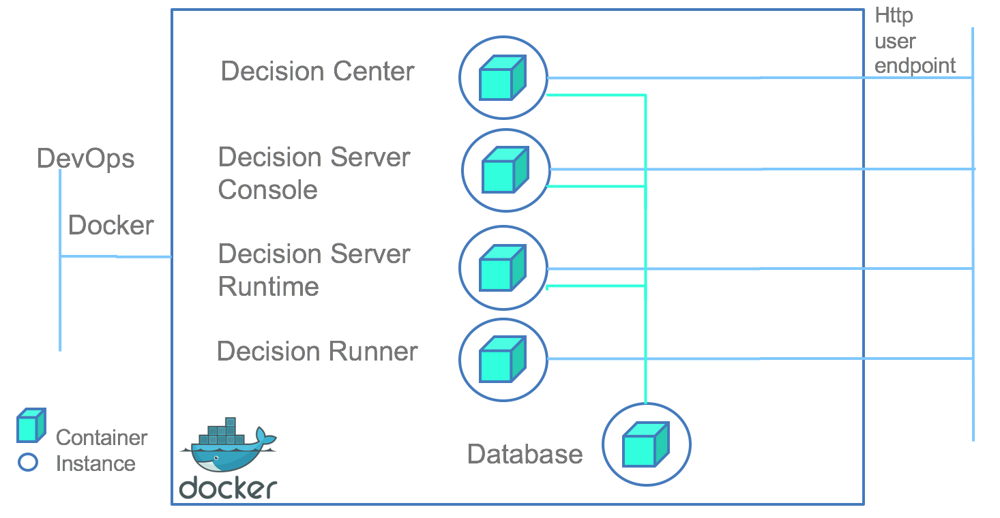

# Standard Tutorial

This tutorial explains how to start an IBM Operational Decision Manager unclustered docker topology for development, using Docker Compose.





## Setting up your environment
Before you proceed, install [Docker and Docker Compose](https://docs.docker.com/compose/#installation-and-set-up).

### Install Operational Decision Manager
To create Operational Decision Manager docker images, install one of the following components:
* Decision Center, with the WebSphere Liberty Profile option,
* Decision Server Rules, with the WebSphere Liberty Profile option.

Go to the Operational Decision Manager installation directory and locate the required WAR files in the directories listed below:

_installation_directory/executionserver/applicationservers/WLP*/res.war_

_installation_directory/executionserver/applicationservers/WLP*/DecisionService.war_

_installation_directory/teamserver/applicationservers/WLP*/teamserver.war_

_installation_directory/teamserver/applicationservers/WLP*/decisioncenter.war_

_installation_directory/teamserver/applicationservers/WLP*/decisionmodel.war_ (starting from ODM vnext)

_installation_directory/executionserver/applicationservers/WLP*/DecisionRunner.war_

### Clone the odm-ondocker code

In the installation directory, enter git clone `https://github.com/ODMDev/odm-ondocker.git`.

### Copy .dockerignore file

Copy the odm-ondocker/resources/.dockerignore file into the ODM installation directory.

```bash
cp odm-ondocker/resources/.dockerignore ./
```

When the copy is complete, the content of your repository should be similar to this:


### Verify that Docker Engine and Docker Compose are running

Open a command prompt and run the following two commands:

```bash
$ docker -version
Docker version 1.12.3
$ docker-compose version
docker-compose version 1.8.1
```

Now you are ready to build and run the docker images.

## Build and run the docker image
Open a command prompt in the directory **installation_directory/odm-ondocker** and run the following command:

```bash
docker-compose  up
```

Note: If you have trouble on Windows os see this [issue](https://github.com/ODMDev/odm-ondocker/issues/100)

This command builds, creates, and runs five docker containers:

* Derby Network database server
* ODM Decision Server runtime
* ODM Decision Server console
* ODM Decision Center
* ODM Decision Runner

Docker Compose builds and runs the containers if they are not already built.

You can also choose to start only one Operational Decision Manager component. For example, this command line starts Decision Center and its dependencies, including the dbserver Derby Network server.

```bash
docker-compose up odm-decisioncenter
```

You can access the application with this URLs:

|Component|URL|Username|Password|
|:-----:|:-----:|:-----:|:-----:|
| [Decision Server Console](http://localhost:9080/res) | <http://localhost:9080/res> |resAdmin|resAdmin|
| [Decision Server Runtime](http://localhost:9090/DecisionService) |<http://localhost:9090/DecisionService> |N/A|N/A|
| [Decision Center Business Console]( http://localhost:9060/decisioncenter) |  <http://localhost:9060/decisioncenter> |rtsAdmin|rtsAdmin|
| [Decision Center Enterprise Console]( http://localhost:9060/teamserver) |  <http://localhost:9060/teamserver> |rtsAdmin|rtsAdmin|
| [Decision Runner]( http://localhost:9070/DecisionRunner) |  <http://localhost:9070/DecisionRunner> |resDeployer|resDeployer|


## Verifying the docker images

You can check the container status with the following command:
```bash
 docker-compose ps
```
 This screen capture displays the list of running containers.


## DBDump Usage

For support and debugging purposes, the Decision Center container is embedding DBDump in the same liberty configuration. So, the authentication access is sharing the same registry. You can access it with a user having the rtsAdministrators role as for example ODMAdmin user.

If `http://<host>:<port>/decisioncenter` is the URL to access the Decision Center service, you can access DBDump at the following URL : `http://<host>:<port>/decisioncenter-dbdump`

DBDump usage is following the same usage than explained in [IBM Support page](https://www.ibm.com/support/pages/decision-center-database-export-utility).
